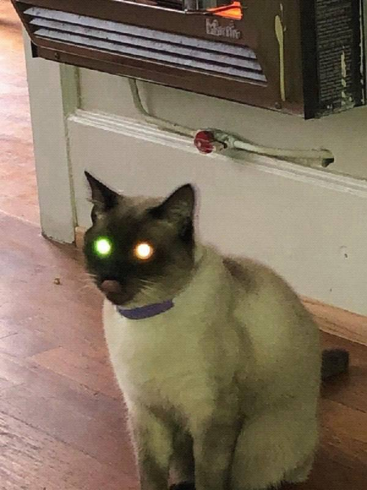
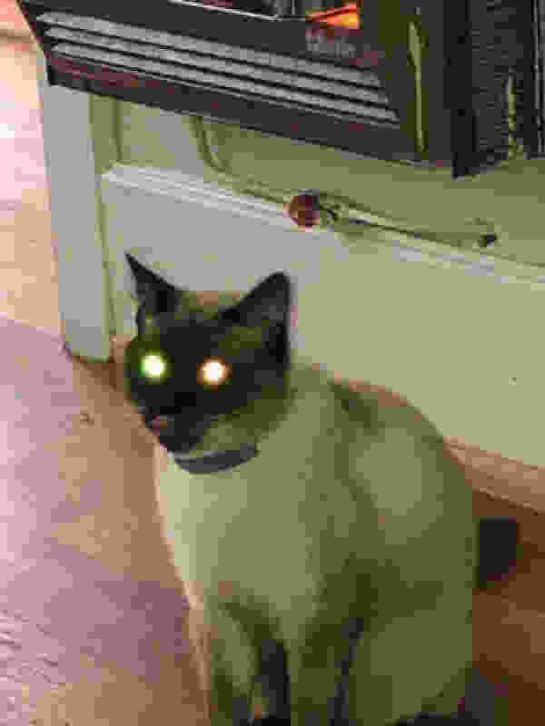
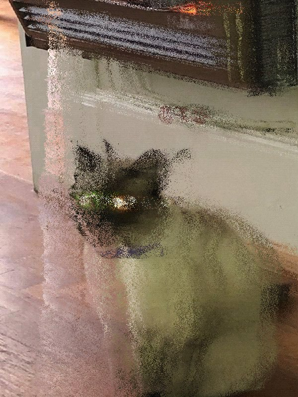
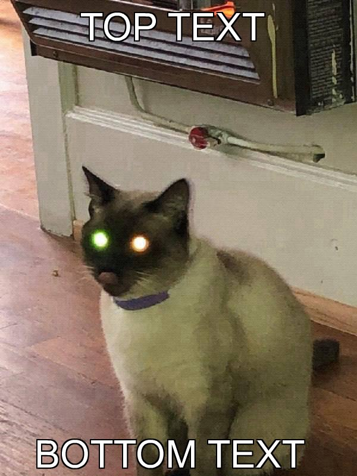
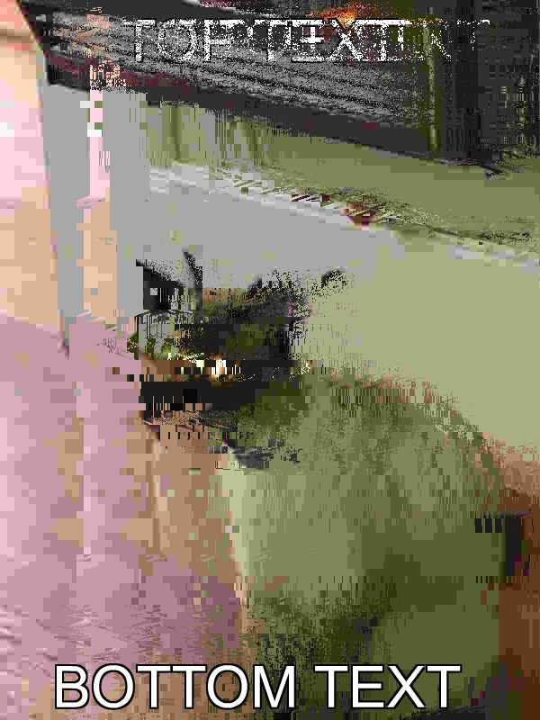

# jimpBot
Reduce the quality of an image, shred it to bits, and add multiline captions with jimpBot. To get started, create your own Telegram bot token with BotFather and connect it to this bot handler package. Once you have started a Node.js instance running bot.js, initiate an image editing session by sending a direct message with a .jpg image file to the bot.

/cook

/dissolve

/toptext TOP TEXT
/bottomtext BOTTOM TEXT

Issue commands in any order you wish but be aware that text becomes part of the image and can be manipulated all the same. 
/cook
/toptext TOP TEXT
/dissolve
/bottomtext BOTTOM TEXT

